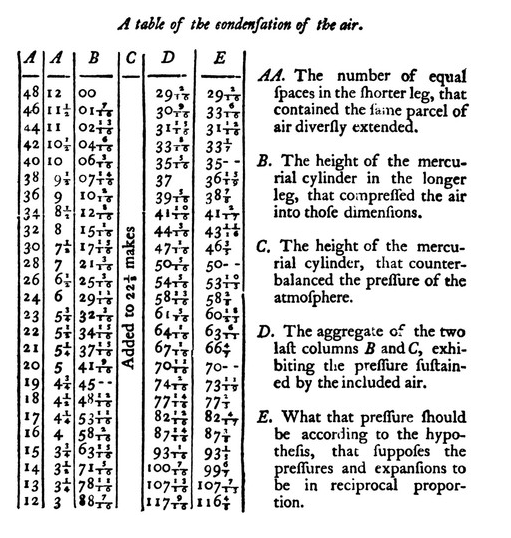

```{r setup, include=FALSE}
knitr::opts_chunk$set(echo = TRUE)
```
```{r}
library(tidyverse)
```

## Purpose 

Testing Boyle's law. Try decoding this:

https://www.physiology.org/doi/full/10.1152/jappl.1999.87.4.1543

```{r, out.width=1000}

```


## Method


We measured pressure using a gauge and volume using something else.

### Apparatus

Balloons, bike-pump, guages.

## Observations

```{r}
good_boyle <- readr::read_csv(here::here("data/good_data.csv")) 

bad_boyle <- readr::read_csv(here::here("data/bad_data.csv")) %>% 
  mutate(
    pressure = pressure+ 
                  400*(runif(nrow(good_boyle))-0.5)
    )

#boyle <- good_boyle
boyle <- bad_boyle
```

We collected `r nrow(boyle)` records. The graph looks like this:

```{r}
boyle %>% ggplot2::ggplot()+
  ggplot2::geom_point(
    ggplot2::aes(x=volume, y=pressure)
    )+
  labs(title="Pressure, what pressure?")


```

Here is a table with our data:

```{r}
#DT::datatable(boyle)
```


And we could generate the linear form:

```{r}
testdata <- boyle %>% dplyr::mutate(
  oneoverV = 1/volume,
  logV     = log(volume),
  
  )

testdata %>% ggplot()+geom_point(aes(x=pressure, y=oneoverV, color=logV))
```

Here is a linear model:

```{r}
model1 <- lm(testdata$pressure ~ testdata$oneoverV)

broom::tidy(model1)

```
```{r}
broom::glance(model1)
```


## Conclusions

Here are some conclusions.

Here are

